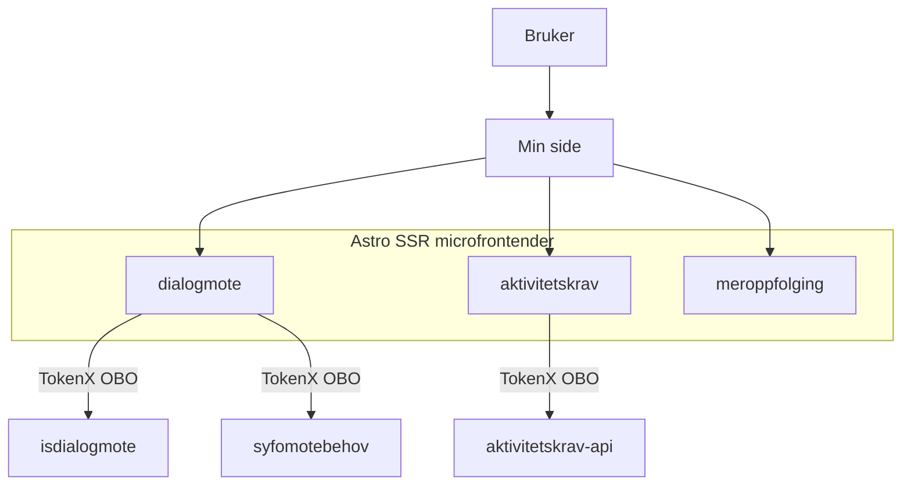
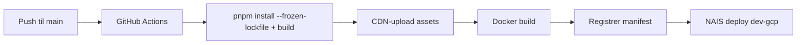

# esyfo-microfrontends

`esyfo-microfrontends` er et Astro SSR-monorepo for syfo-relaterte microfrontender på Min side (nav.no) for innloggede privatpersoner.

Repoet samler og erstatter fire tidligere repoer i én løsning:
- `aktivitetskrav-mikrofrontend`
- `dialogmote-mikrofrontend`
- `meroppfolging-mikrofrontend`
- `esyfo-proxy`

Microfrontendene aktiveres av [esyfovarsel](https://github.com/navikt/esyfovarsel) og følger [TMS-modellen for microfrontender på Min side](https://navikt.github.io/tms-dokumentasjon/microfrontend/).

## Arkitektur (ny løsning)



Alle workspace-appene følger samme mønster: SSR i Astro, token-validering og OBO på serversiden, deretter kall til backend-APIer.

## Monorepostruktur

```text
esyfo-microfrontends/
├── package.json                  # Root: delte avhengigheter + workspace-scripts
├── microfrontends/
│   ├── dialogmote/               # Dialogmøte-microfrontend
│   ├── aktivitetskrav/           # Aktivitetskrav-microfrontend
│   └── meroppfolging/            # Meroppfølging-microfrontend (ikke påbegynt)
```

Repoet bruker **pnpm workspaces**. Workspace-konfigurasjonen ligger i `pnpm-workspace.yaml`, avhengigheter ligger i root `package.json`, og hvert workspace er en selvstendig Astro SSR-app med egne scripts, build og deploy.

## Teknologioversikt

| Kategori | Teknologi |
|----------|-----------|
| Framework | Astro 5 (SSR med @astrojs/node) |
| UI | React 18, @navikt/ds-react (Aksel) |
| Auth | @navikt/oasis (TokenX validering + OBO) |
| Validering | Zod |
| Logging | pino |
| Observability | OpenTelemetry (auto-instrumentert av NAIS) |
| Lint/format | Biome |
| Mock server | Hono |
| CSS-scoping | postcss-prefix-selector |
| Container | distroless Node.js |
| Plattform | NAIS (Kubernetes på GCP) |

## Lokal utvikling

```bash
pnpm install
pnpm run dev:dialogmote-microfrontend     # Astro dev + mock server
pnpm run dev:aktivitetskrav-microfrontend
```

Appen kjører på `http://localhost:4321/`. I dev brukes mock-server for å simulere backend-APIer.

## Bygging

```bash
pnpm run build:dialogmote-microfrontend
pnpm run build:aktivitetskrav-microfrontend
```

## Deploy-flyt



> **Merk:** Prod-deploy er foreløpig deaktivert. Kun dev-gcp er aktivt.

## Backend-integrasjoner

### Dialogmote
- `isdialogmote` (teamsykefravr) — dialogmøtebrev
- `syfomotebehov` (team-esyfo) — møtebehov

### Aktivitetskrav
- `aktivitetskrav-api` — aktivitetskravvurdering

### Meroppfolging
- Ikke påbegynt

## Migreringsstatus

| Workspace | Status | Merknad |
|-----------|--------|---------|
| dialogmote | ✅ Under aktiv utvikling | Domenelogikk migrert, deployes til dev |
| aktivitetskrav | ✅ Under aktiv utvikling | Domenelogikk implementert, deployes til dev |
| meroppfolging | ⏳ Ikke påbegynt | Workflow finnes, men kode mangler |
| esyfo-proxy | 🔄 Erstattet | Innebygd i hver workspace via Astro middleware |

## Kontakt

- **Team:** team-esyfo, NAV IT
- **Slack:** #team-esyfo
