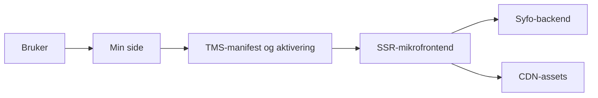

# eSyfo microfrontends for Min side

Astro SSR-monorepo for eSyfo-mikrofronter på Min side. Inneholder [dialogmøte](docs/architecture-dialogmote.md), [aktivitetskrav](docs/architecture-aktivitetskrav.md), [motebehov](docs/architecture-motebehov.md) og [meroppfølging](docs/architecture-meroppfolging.md), med felles [bygg og deploy](docs/github-workflows.md) og [dokumentasjon](#les-mer).

[🎬 Storybook](https://navikt.github.io/esyfo-microfrontends/)

[🛠️ GitHub Actions](https://github.com/navikt/esyfo-microfrontends/actions)

[🧩 TMS-dokumentasjon for microfrontends](https://navikt.github.io/tms-dokumentasjon/microfrontend/)

## Formålet med repoet

Repoet samler eSyfo-mikrofronter som vises på Min side. Hver mikrofrontend er en Astro SSR-app som validerer token i middleware, henter data på serversiden og renderer et panel med felles komponenter fra `@esyfo/shared`.

Vi bruker Storybook til å vise tekster, tilstander og komponentvarianter uten å starte hele Min side. Det gjør det enklere å gå gjennom innhold, domenevarianter og UI-endringer.

## Mikrofronter i repoet

| Mikrofrontend  | Manifest-id           | Backend                 |
| -------------- | --------------------- | ----------------------- |
| dialogmøte     | `syfo-dialog`         | `isdialogmote`          |
| aktivitetskrav | `syfo-aktivitetskrav` | `aktivitetskrav-backend` |
| motebehov      | `syfo-motebehov`      | `syfomotebehov`         |
| meroppfølging  | `syfo-meroppfolging`  | `meroppfolging-backend` |

## Les mer

- [Lokal utvikling](docs/local-development.md)
- [GitHub workflows](docs/github-workflows.md)
- [Aktivering og deaktivering i esyfovarsel](docs/microfrontend-activation.md)
- [Integrasjon i Min side](docs/min-side-integration.md)
- [Arkitektur for dialogmøte](docs/architecture-dialogmote.md)
- [Arkitektur for aktivitetskrav](docs/architecture-aktivitetskrav.md)
- [Arkitektur for motebehov](docs/architecture-motebehov.md)
- [Arkitektur for meroppfølging](docs/architecture-meroppfolging.md)
