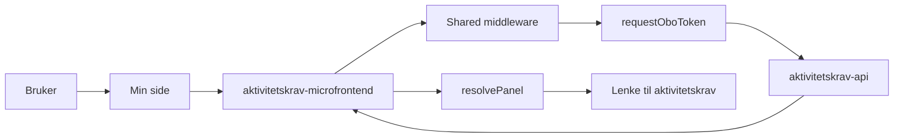

# Arkitektur for aktivitetskrav

`aktivitetskrav` viser status for aktivitetskrav på Min side. Mikrofrontenden henter én vurdering fra `aktivitetskrav-api` og oversetter statusen til riktig paneltekst, tag og lenke.

## Flyt

## Hva appen gjør

1. Min side kaller SSR-appen.
2. Shared middleware validerer TokenX-tokenet.
3. `fetchVurdering` henter vurderingen fra backend og validerer svaret med Zod.
4. `resolvePanel` velger hva brukeren skal se ut fra `status`.
5. Appen viser ikke panel når status er `IKKE_OPPFYLT`.

## Statuser som påvirker panelet

- `NY`, `NY_VURDERING`, `AVVENT`: viser at Nav vurderer saken
- `UNNTAK`, `OPPFYLT`, `IKKE_AKTUELL`: viser resultat med dato-tag
- `FORHANDSVARSEL`: viser varsel og svarfrist
- `IKKE_OPPFYLT`: viser ingenting på Min side

## Viktige filer

- `src/pages/[locale]/index.astro`
- `src/infrastructure/fetch.ts`
- `src/domain/panelResolver.ts`

## Backend og lenker

| Del | Verdi |
| --- | --- |
| Backend | `AKTIVITETSKRAV_API_URL` |
| Client ID for OBO | `AKTIVITETSKRAV_CLIENT_ID` |
| Mål for lenken i panelet | `AKTIVITETSKRAV_URL` |
| Manifest-id | `syfo-aktivitetskrav` |

## Notater

- I development bruker appen mock-data.
- Zod-skjemaet avviser ugyldige svar fra backend.
- Panelet bygges med `MainPanel` fra `@esyfo/shared/components`.
