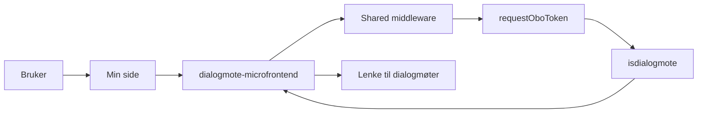

# Arkitektur for dialogmøte

`dialogmote` viser status for dialogmøte på Min side. Mikrofrontenden henter brevdata fra `isdialogmote` og viser panelet når siste relevante brev er en innkalling eller et brev om nytt tid og sted.

## Flyt

## Hva appen gjør

1. Min side kaller SSR-appen.
2. Shared middleware validerer TokenX-tokenet.
3. `fetchBrev` henter data fra `isdialogmote` via `fetchFromBackend`.
4. Appen finner siste relevante brev.
5. Panelet vises bare når brevtypen er `INNKALT` eller `NYTT_TID_STED`.

## Viktige filer

- `src/pages/[locale]/index.astro`
- `src/infrastructure/fetch.ts`
- `src/domain/brev.ts`
- `src/domain/panelResolver.ts`

## Backend og lenker

| Del | Verdi |
| --- | --- |
| Backend | `ISDIALOGMOTE_API_URL` |
| Client ID for OBO | `ISDIALOGMOTE_CLIENT_ID` |
| Mål for lenken i panelet | `${DIALOGMOTE_URL}/moteinnkalling` |
| Manifest-id | `syfo-dialog` |

## Notater

- I development bruker appen mock-data i stedet for ekte backend-kall.
- Middleware kommer fra `@esyfo/shared/middleware`.
- Den visuelle boksen bygger på `MainPanel` fra `@esyfo/shared/components`.
