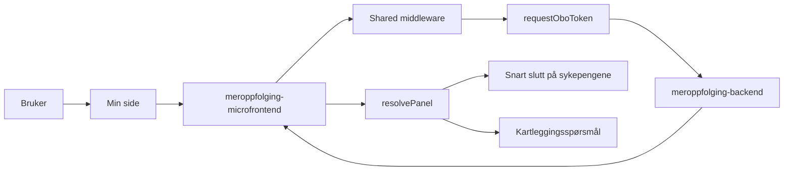

# Arkitektur for meroppfølging

`meroppfolging` viser om brukeren bør svare på spørsmål om mer oppfølging. Mikrofrontenden henter status fra `meroppfolging-backend` og viser enten sen oppfølging eller kartlegging, avhengig av hvilken type oppfølging brukeren er i.

## Flyt

## Hva appen gjør

1. Min side kaller SSR-appen.
2. Shared middleware validerer TokenX-tokenet.
3. `fetchStatus` henter status og validerer svaret med Zod.
4. `resolvePanel` velger visning ut fra `oppfolgingsType`.
5. Panelet lenker videre til riktig Nav-side.

## Hvordan panelet velges

- `INGEN_OPPFOLGING`: viser ingenting
- `SEN_OPPFOLGING`: viser status for snart slutt på sykepengene
- `KARTLEGGING`: viser status for kartleggingsspørsmål

Ved svart status viser appen bare panelet i en begrenset periode. Etter det skjules panelet igjen.

## Viktige filer

- `src/pages/[locale]/index.astro`
- `src/infrastructure/fetch.ts`
- `src/domain/panelResolver.ts`

## Backend og lenker

| Del | Verdi |
| --- | --- |
| Backend | `MEROPPFOLGING_API_URL` |
| Client ID for OBO | `MEROPPFOLGING_CLIENT_ID` |
| Lenke ved sen oppfølging | `SSPS_URL` |
| Lenke ved kartlegging | `KARTLEGGING_URL` |
| Manifest-id | `syfo-meroppfolging` |

## Notater

- I development bruker appen mock-data.
- Denne mikrofrontenden bygger på samme shared middleware og fetch-mønster som de andre appene.
- Panelet bruker `MainPanel` fra `@esyfo/shared/components`.
