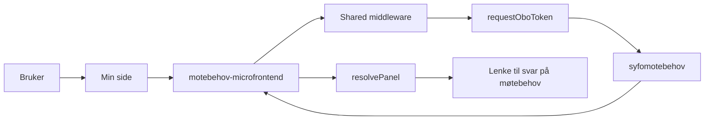

# Arkitektur for motebehov

`motebehov` viser om brukeren bør svare på møtebehov på Min side. Mikrofrontenden henter status fra `syfomotebehov` og viser panelet når brukeren skal svare på behovsskjemaet og ikke har svart ennå.

## Flyt

## Hva appen gjør

1. Min side kaller SSR-appen.
2. Shared middleware validerer TokenX-tokenet.
3. `fetchMotebehov` henter status og validerer svaret med Zod.
4. `shouldShowMotebehovPanel` avgjør om panelet skal vises.
5. `resolvePanel` lager teksten og lenken til svarskjemaet.

## Når panelet vises

Panelet vises bare når alle disse vilkårene er oppfylt:

- `visMotebehov === true`
- `skjemaType === "SVAR_BEHOV"`
- `motebehov === null`

Hvis brukeren allerede har svart, viser appen ikke panelet.

## Backend og lenker

| Del | Verdi |
| --- | --- |
| Backend | `SYFOMOTEBEHOV_API_URL` |
| Client ID for OBO | `SYFOMOTEBEHOV_CLIENT_ID` |
| Mål for lenken i panelet | `${MOTEBEHOV_URL}/motebehov/svar` |
| Manifest-id | `syfo-motebehov` |
