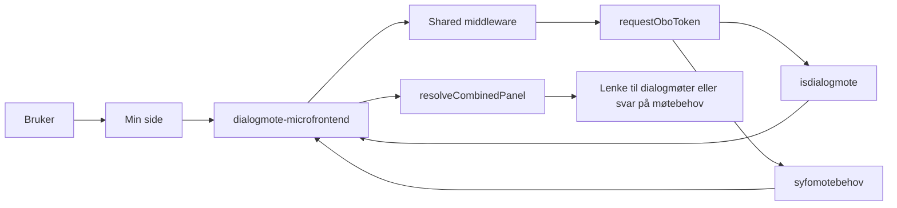

# Dialogmøtearkitektur

`dialogmote` viser status for dialogmøte på Min side, og håndterer også møtebehov i samme mikrofrontend. Mikrofrontenden henter brevdata fra `isdialogmote` og møtebehovstatus fra `syfomotebehov`, og velger hvilket panel som skal vises ut fra den samlede flyten.

## Flyt

## Hva appen gjør

1. Min side kaller SSR-appen.
2. Shared middleware validerer TokenX-tokenet.
3. `fetchBrev` henter brevdata fra `isdialogmote`, og `fetchMotebehov` henter møtebehovstatus fra `syfomotebehov`.
4. Appen finner siste relevante brev og vurderer møtebehovstatus i samme request.
5. `resolveCombinedPanel` prioriterer dialogmøtepanelet når siste relevante brev har typen `INNKALT` eller `NYTT_TID_STED`.
6. Hvis dialogmøtepanelet ikke skal vises, men brukeren skal svare på møtebehov, vises møtebehov-panelet i stedet.

## Backend og lenker

| Del                      | Verdi                                                                       |
| ------------------------ | --------------------------------------------------------------------------- |
| Backend                  | `isdialogmote`, `syfomotebehov`                                             |
| Client ID for OBO        | `ISDIALOGMOTE_CLIENT_ID`, `SYFOMOTEBEHOV_CLIENT_ID`                         |
| Mål for lenken i panelet | `${DIALOGMOTE_URL}/moteinnkalling` eller `${DIALOGMOTE_URL}/motebehov/svar` |
| Manifest-id              | `syfo-dialog`                                                               |
