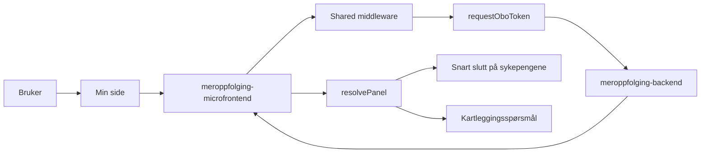

# Meroppfølgingsarkitektur

`meroppfolging` viser om brukeren bør svare på spørsmål om mer oppfølging. Mikrofrontenden henter status fra `meroppfolging-backend` og viser enten sen oppfølging eller kartlegging, avhengig av hvilken type oppfølging brukeren er i.

## Flyt

## Hva appen gjør

1. Min side kaller SSR-appen.
2. Shared middleware validerer TokenX-tokenet.
3. `fetchStatus` henter status og validerer svaret med Zod.
4. `resolvePanel` velger visning ut fra `oppfolgingsType`.
5. Panelet lenker videre til riktig Nav-side.

## Backend og lenker

| Del                      | Verdi                     |
| ------------------------ | ------------------------- |
| Backend                  | `MEROPPFOLGING_BACKEND_HOST` |
| Client ID for OBO        | `MEROPPFOLGING_CLIENT_ID` |
| Lenke ved sen oppfølging | `SSPS_URL`                |
| Lenke ved kartlegging    | `KARTLEGGING_URL`         |
| Manifest-id              | `syfo-meroppfolging`      |
