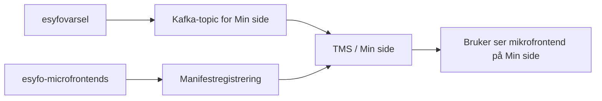

# Aktivering og deaktivering i esyfovarsel

En mikrofrontend vises bare når to ting er på plass:

1. dette repoet har deployet appen og registrert den i manifestet
2. `esyfovarsel` har sendt en enable-melding for brukeren

Dette repoet eier bygg, deploy og manifest. `esyfovarsel` eier om en bruker faktisk skal se panelet.

## Ansvarsdeling

| Ansvar                                               | Repo                   |
| ---------------------------------------------------- | ---------------------- |
| Bygge Astro-app, laste opp assets og deploye SSR-app | `esyfo-microfrontends` |
| Registrere `manifest_id` og URL i TMS-manifestet     | `esyfo-microfrontends` |
| Avgjøre om en bruker skal se en mikrofrontend        | `esyfovarsel`          |
| Sende enable- og disable-meldinger til Min side      | `esyfovarsel`          |

## Hvordan flyten virker

## Meldingsformat

Min side bruker enable- og disable-meldinger på Kafka-topicet for mikrofronter. Selve meldingsformatet er dokumentert i TMS-dokumentasjonen:

- [Aktivere og deaktivere microfrontends](https://navikt.github.io/tms-dokumentasjon/microfrontend/)

## Manifest-id-er i dette repoet

| Mikrofrontend  | Manifest-id           |
| -------------- | --------------------- |
| dialogmøte     | `syfo-dialog`         |
| aktivitetskrav | `syfo-aktivitetskrav` |
| meroppfølging  | `syfo-meroppfolging`  |

`esyfovarsel` må bruke samme `microfrontend_id` som manifestet i dette repoet.

## Dialogmøte og møtebehov

Møtebehov vises som et panel inne i `syfo-dialog` når SSR-requesten til dialogmøte-mikrofrontenden henter data og `resolveCombinedPanel` velger møtebehov-panelet. Det betyr at `esyfovarsel` bare trenger å aktivere og deaktivere `syfo-dialog` for denne flyten.

## Det `esyfovarsel` gjør i dag

`esyfovarsel` har egne services for å oppdatere synlighet for:

- `syfo-dialog`
- `syfo-aktivitetskrav`
- `syfo-meroppfolging`

Disse serviceklassene oppretter `MinSideRecord` med `@action`, `ident` og `microfrontend_id`, og sender dem videre til Min side-topicet.

## Hva deaktivering betyr

Deaktivering skjer når `esyfovarsel` sender en disable-melding, eller når synlighetsperioden går ut og tjenesten lukker mikrofrontenden automatisk. Da slutter Min side å vise panelet for brukeren, selv om appen fortsatt er deployet og registrert i manifestet.
