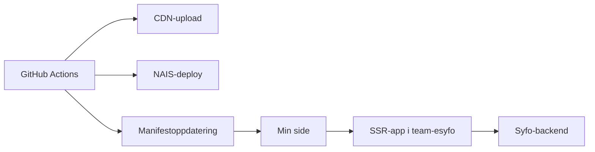

# Integrasjon i Min side

Mikrofrontene i dette repoet lever inne i Min side. De er ikke bygget som egne sluttbruker-apper med en offentlig hoved-URL. Min side laster dem inn når manifestet er registrert og brukeren er aktivert for den aktuelle mikrofrontenden.

## Slik henger det sammen

## Delene i integrasjonen

### 1. Client-assets ligger på CDN

Hver Astro-app bygger client-assets med `assetsPrefix` mot `https://cdn.nav.no/min-side/<appnavn>`.

Det gjør at Min side kan hente JavaScript, CSS og andre statiske filer fra CDN.

### 2. SSR-appen kjører på NAIS

Hver mikrofrontend deployes som en egen app i `team-esyfo`. Appen renderer HTML på serversiden og kaller backendene med OBO-token.

### 3. Manifestet peker Min side til riktig app

Deploy-workflowen oppdaterer mikrofrontend-manifestet med:

- `manifest_id`
- intern URL for mikrofrontenden
- appnavn
- `ssr: true`

Manifestet forteller Min side hvor mikrofrontenden finnes.

### 4. Min side får lov til å kalle appen

NAIS-manifestene åpner for innkommende trafikk fra:

- `application: tms-min-side`
- `namespace: min-side`

Det er denne koblingen som lar Min side hente SSR-innholdet fra mikrofrontendene.

## Hva brukeren faktisk ser

Brukeren ser et lite panel på Min side. Panelet er ikke selve fagapplikasjonen. Det er en inngang til videre oppfølging, for eksempel dialogmøter, aktivitetskrav, møtebehov eller mer oppfølging.

Lenkene i panelene peker videre til vanlige Nav-sider. Mikrofrontenden har ansvar for å vise riktig tekst, status og lenke på Min side.

## Feilsøking: er mikrofrontenden faktisk oppe?

Start med logger i GCP/Grafana. I praksis er det som regel nok med to hovedsjekker.

### Mikrofrontenden lastes ikke i det hele tatt

Når bare et grått panel er synlig, er det ofte best å starte i loggene til Min side, siden det er Min side som prøver å hente SSR-innholdet fra mikrofrontenden.

📙 [Team Min side app logs i Grafana](https://grafana.nav.cloud.nais.io/d/d0c65ea3-1f01-4d11-b5dd-d4d3fb874c9f/team-min-side-app-logs?orgId=1&from=now-1h&to=now&timezone=browser&var-cluster=PD969E40991D5C4A8&var-app_name=$__all&var-include_status_code=$__all&var-detection_level=error)

Hvis mikrofrontenden ikke lastes, er det ofte her du først ser feil knyttet til manifest, tilgjengelighet, kall mot SSR-appen eller andre integrasjonsfeil mellom Min side og mikrofrontenden.

2. Appen lastes, men fallback vises

Da har Min side nådd mikrofrontenden, men selve appen har feilet under rendering eller datainnhenting. Start med loggene til mikrofrontenden, og sjekk deretter backend-loggene hvis det ser ut som problemet ligger i et downstream-kall.

Et nyttig spor her er schema-validering. Når backend-respons ikke matcher forventet schema, logges dette med `validationErrors` i Grafana. Se derfor etter logger som viser:

- `Invalid <appnavn> response`
- `validationErrors`

Hvis mikrofrontend-loggene ser riktige ut, men data fortsatt ikke stemmer, bør du også sjekke loggene til den aktuelle backend-tjenesten.
