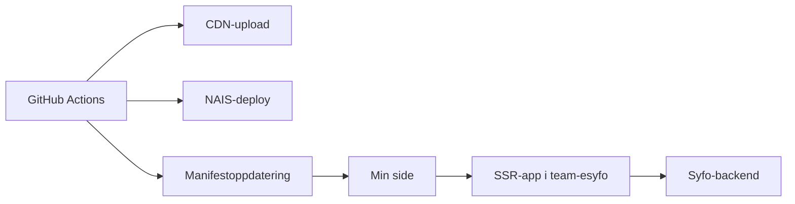

# Integrasjon i Min side

Mikrofrontene i dette repoet lever inne i Min side. De er ikke bygget som egne sluttbruker-apper med en offentlig hoved-URL. Min side laster dem inn når manifestet er registrert og brukeren er aktivert for den aktuelle mikrofrontenden.

## Slik henger det sammen



## Delene i integrasjonen

### 1. Client-assets ligger på CDN

Hver Astro-app bygger client-assets med `assetsPrefix` mot `https://cdn.nav.no/min-side/<appnavn>`.

Det gjør at Min side kan hente JavaScript, CSS og andre statiske filer fra CDN.

### 2. SSR-appen kjører på NAIS

Hver mikrofrontend deployes som en egen app i `team-esyfo`. Appen renderer HTML på serversiden og kaller backendene med OBO-token.

### 3. Manifestet peker Min side til riktig app

Deploy-workflowen oppdaterer mikrofrontend-manifestet med:

- `manifest_id`
- intern URL for mikrofrontenden
- appnavn
- `ssr: true`

Manifestet forteller Min side hvor mikrofrontenden finnes.

### 4. Min side får lov til å kalle appen

NAIS-manifestene åpner for innkommende trafikk fra:

- `application: tms-min-side`
- `namespace: min-side`

Det er denne koblingen som lar Min side hente SSR-innholdet fra mikrofrontendene.

## Hva brukeren faktisk ser

Brukeren ser et lite panel på Min side. Panelet er ikke selve fagapplikasjonen. Det er en inngang til videre oppfølging, for eksempel dialogmøter, aktivitetskrav, møtebehov eller mer oppfølging.

Lenkene i panelene peker videre til vanlige Nav-sider. Mikrofrontenden har ansvar for å vise riktig tekst, status og lenke på Min side.

## Feilsøking: er mikrofrontenden faktisk oppe?

Hvis du vil verifisere fra egen maskin at en deployet mikrofrontend kjører i Kubernetes og svarer på health-endepunktene, kan du sjekke logger, starte `port-forward` og kalle endepunktene direkte.

Sjekk først at `kubectl` peker mot riktig cluster og context. Bytt også ut appnavn og lokal port ved behov. Her brukes `aktivitetskrav-microfrontend` og `8080` som eksempel:

1. Se logger i ett terminalvindu hvis du vil følge oppstart og kall fortløpende:

```bash
kubectl -n team-esyfo logs -l app=aktivitetskrav-microfrontend --tail=200 -f
```

2. Start `port-forward` i et eget terminalvindu, og la kommandoen stå og kjøre:

```bash
kubectl -n team-esyfo port-forward svc/aktivitetskrav-microfrontend 8080:80
```

3. Kall health-endepunktene fra et tredje terminalvindu, eller fra det første etter at du er ferdig med å følge logger:

```bash
curl -i http://localhost:8080/api/internal/isAlive
curl -i http://localhost:8080/api/internal/isReady
```

- `logs` gjør det enkelt å se om appen starter og håndterer kall som forventet.
- `port-forward` gjør den deployede appen tilgjengelig lokalt uten å gå via Min side.
- `isAlive` og `isReady` bekrefter at containeren kjører og er klar til å ta trafikk.

## Storybook i denne sammenhengen

Storybook er ikke en del av Min side-integrasjonen. Vi bruker Storybook til å vise komponenter, tekster og tilstander i isolasjon. Det gjør det enklere å gå gjennom innhold uten å trigge aktivering i Min side.
